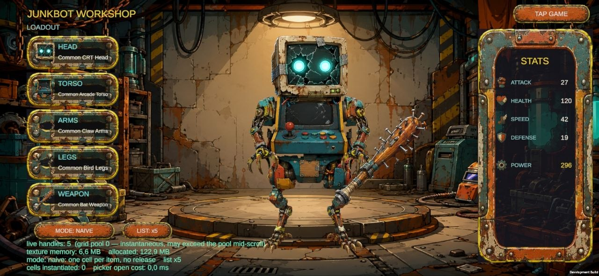
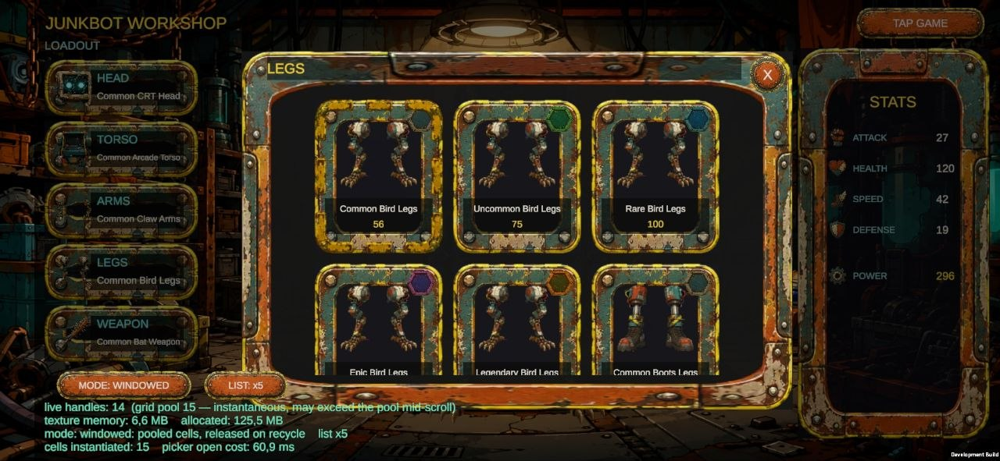

# Tap-the-Object Addressables Demo

A small Unity game exploring async Addressables loading under rapid state changes. One 3D object sits on screen wearing an
image loaded **asynchronously via Addressables**. Tap it → score goes up and a new image loads (the next
round). Tap empty space → the object flashes red and keeps its image. If a new round starts before the
previous image finished downloading, the stale download is cancelled so it can never overwrite the newer one.

The repository also contains **Junkbot Workshop**, an extension built afterward: a modular robot
assembly screen driven by the same Addressables discipline at a much larger scale — see
[Junkbot Workshop](#junkbot-workshop-extension) below. The workshop is the **startup scene**, and the two
scenes reach each other: `TAP GAME` in the workshop, `WORKSHOP` in the tap game.

Adding that button surfaced a gap in the original tap handling: `GameController` raycast every tap into the
scene unconditionally, so a tap that landed on UI also missed the object and registered as an incorrect tap.
The fix is a pointer-over-UI check ahead of the raycast, using the tap's own screen position (rather than
`EventSystem.IsPointerOverGameObject()`, whose no-argument form answers for the mouse pointer id and does not
cover touch). It covers every raycastable UI element in the scene, not only the button.

## Stack

- **Unity `6000.3.5f2`**, **URP 17.3.0**, Android target (runs in the Editor with mouse).
- **Addressables 2.8.1** — async asset loading, local emulation + optional remote (S3/CloudFront) delivery.
- **Input System 1.17.0** — `Pointer.current` unifies mouse (Editor) and touch (device).
- Plain C# `async/await` + one coroutine (the flash). No third-party packages.

## Run it

1. Open the project in Unity `6000.3.5f2`.
2. Open `Assets/Scenes/TapGameScene.unity` (the tap game). `Assets/Scenes/WorkshopScene.unity` is the
   startup scene of the extension and can be played the same way.
3. **Addressables ▸ Groups ▸ Play Mode Script = "Use Asset Database (fastest)"** (default local mode — no
   content build needed).
4. Press **Play**. Status shows `Loading…` → `Tap the object!`; the sphere appears with an image, score `0`.
5. **Click the sphere** → score increments, a new image loads. **Click empty space** → the object flashes red.

> **Keep the Game view focused, or tick Edit ▸ Preferences ▸ General ▸ *Run In Background*.** An unfocused
> Editor stops ticking the player loop, so `await` continuations never resume: loads stay in flight and the
> workshop's live-handle counter reads like a leak that is really just a paused game. Alt-tabbing away to read
> these instructions is enough to trigger it.

Local mode works out of the box. Remote delivery (the spec's optional point 3) is configured and documented
under [Remote delivery](#remote-delivery-optional) below.

## Controls

- **Tap / left-click the object** — correct selection: `+1` score, next round (new image).
- **Tap / click empty space** — incorrect: red flash, image and score unchanged.

## Architecture

Deliberately small — a handful of focused classes, namespace `Junkinnering`, no framework scaffolding.

| Script | Role |
|--------|------|
| `AddressableAssetService` | Loads the **prefab** and the **fallback texture** exactly **once** at startup, holds their handles, releases them on teardown. Status-checked, cancellable. |
| `RoundImageLoader` | Resolves the `round_image` Addressables **label** to its texture locations once, then hands out a **random** texture load per round. Returns the handle without throwing; the caller checks status and owns the release. |
| `GameController` | Orchestrates rounds, score, status text, the red flash, and the **per-round stale-download cancellation**. Owns all lifecycle. |
| `TapInput` | One tap per frame from `Pointer.current` (mouse + primary touch), null-safe. |
| `TextureApplier` | Applies a texture (`_BaseMap`) / tint (`_BaseColor`) via a `MaterialPropertyBlock` — no per-object material instance, no leak. |

### Assets

- `Assets/Prefabs/TargetObject.prefab` — the Addressable sphere (with collider).
- `Assets/Textures/fallback.png` — the Addressable fallback texture.
- `Assets/Textures/Rounds/img_0…3.png` — the round images, all tagged with the Addressables label
  `round_image`.

## Key design decisions

- **Non-blocking async, failure via status — never `WaitForCompletion`.** Every load `await`s
  `handle.Task`. Because `AsyncOperationHandle.Task` completes *without throwing* on a failed load, the code
  checks `handle.Status == Succeeded` rather than relying on try/catch; a genuine failure applies the
  **fallback** texture, distinct from a cancellation.
- **Stale-download cancellation (the crux).** Each round owns a `CancellationTokenSource` linked to a master
  token. Starting a new round cancels the previous one; after the `await`, the round checks its **own
  captured** token (not a shared field) and discards its result if it was superseded — so even a superseded
  load that finishes *after* a newer round already applied can never overwrite it. The freshest round always
  wins.
- **Addressables lifecycle.** Prefab + fallback are loaded once and released on teardown; each per-round image
  handle is released the moment it is replaced, superseded, or fails — the new texture is applied *before* the
  old handle is released, so the object never shows a blank frame.
- **Input abstraction.** `Pointer.current` means the identical tap→raycast path serves mouse in the Editor and
  touch on device.
- **URP.** Textures/tints go through a `MaterialPropertyBlock` on `_BaseMap` / `_BaseColor` (URP's slots),
  avoiding a leaked material instance.

## Spec coverage

| # | Requirement | Where |
|---|-------------|-------|
| a | 1 object spawned from an Addressable prefab | `GameController.Start` → `AddressableAssetService` |
| b | Texture loaded via Addressables, async, non-blocking | `RoundImageLoader` / `GameController.StartRoundAsync` |
| c | Fallback Addressable texture on download failure | `StartRoundAsync` `Status != Succeeded` branch |
| d | Prefab + fallback loaded once, released on teardown | `AddressableAssetService` + `GameController.OnDestroy` |
| e | Status text (`Loading…` / `Tap the object!`) | `GameController` status updates |
| f | Score text, incremented per correct tap | `GameController.OnCorrectTap` |
| g | Hit → new image + round; miss → negative flash, image unchanged | `GameController.Update` → `OnCorrectTap` / `OnIncorrectTap` |
| h | New round cancels the previous unfinished download | per-round `CancellationTokenSource`, captured-local-token check |

## Junkbot Workshop (extension)

Built afterward, to exercise what a content-heavy live game actually needs: a large
part inventory whose art is streamed in a **bounded window**, recycling as a cancellation trigger, and
concurrent operations that must supersede within a scope while staying independent across scopes.

- **150 catalog entries** (6 base parts × 5 rarity tiers × 5 slots) over 30 sprites, so the grid genuinely
  recycles on real data.
- **Two Addressable entries per part** — `<partId>.icon` (128²) for the grid, `<partId>.full` (512²) for the
  equipped robot: a 16× pixel ratio between what a cell costs and what the rig costs.
- **The grid loads only the visible window and releases on recycle**, so live handles are bounded by the cell
  pool rather than by catalog size. A dev overlay prints the live handle count against the pool, plus texture
  and total allocated memory.
- **Per-cell and per-slot generation tokens.** A rebound cell discards its stale icon; equipping a head and a
  torso in the same frame supersedes *within* each slot and never across them.

| Script | Role |
|--------|------|
| `PartCatalog` / `PartDefinition` / `PartStats` | Data. The catalog holds **address strings**, never Sprite references — a direct reference would make every texture a build dependency of the catalog's bundle. |
| `RobotLoadout` | Pure model: slot → part, aggregation, and a throw when a part is equipped into the wrong slot. |
| `GridWindow` | Pure static window math (`firstIndex`/`lastIndex`, content height). Unit-tested directly. |
| `ISpriteSource` / `AddressableSpriteSource` | The one abstraction, and it exists for testability. Never throws: a failure or a cancellation returns a lease with no sprite, and every exit routes through one decrement so the live count cannot drift. |
| `PartCardView` | One pooled grid cell. Releases its stored lease *before* starting the next load, so the stored lease is bounded at one per cell. |
| `PartPickerView` | Virtualized grid: a fixed pool positioned by index over a scroll content sized from the item count. The content carries **no layout group** — one would re-lay the pool every frame and defeat virtualization. |
| `WorkshopController` | Owns the loadout, the equip path and the picker; the only Unity lifecycle owner on the screen. |
| `DiagnosticsOverlay` | The live readout. **Dev-gated by design**: it deletes itself when `!UNITY_EDITOR && !DEVELOPMENT_BUILD`, so a release build ships without it — which is why the demo APK is a Development Build. |
| `SafeAreaFitter` | Insets interactive UI to `Screen.safeArea`; only the full-bleed background sits outside it. |

### The naive/windowed toggle

The bounded-window claim is invisible by construction — a working screen looks the same either way — so the
overlay carries a **MODE** button that rebuilds the open picker with the default implementation anyone would
write first: **one cell per item, each loading its own icon, nothing released until close.** It is labelled
in the UI as exactly that, so the comparison reads as honest rather than rigged, and it routes through the
same `ISpriteSource`, so the live handle counts are directly comparable.

Measured in the Editor on one slot's 30 entries (Play Mode Script = Use Asset Database):

| | Cells instantiated | Live handles | Picker open cost |
|---|---|---|---|
| Windowed | 15 (the pool) | 9 grid handles | ~3–5 ms |
| Naive | 30 (one per item) | 30 | ~21 ms |

A second dev button, **LIST ×1 / ×5**, multiplies the open list so the comparison can be seen at demo scale
without a second build. At ×5 (150 entries in one picker) the toggle reads **150 cells / 155 live handles /
~80 ms to open** against the pool's unchanged **15 / 14 / ~2 ms**, from the same data, through the same
sprite source.

Editor figures understate it, because Play Mode Script = Use Asset Database hands back assets that are
already loaded. On a **Samsung Galaxy A15 (SM-A155F)**, at ×5:

| | Cells instantiated | Live handles | Picker open cost |
|---|---|---|---|
| Windowed | 15 (the pool) | 14 | **61 ms** |
| Naive | 150 (one per item) | 155 | **262 ms** |

262 ms is roughly sixteen frames at 60 fps — a stall you feel rather than measure. `155 = 150 icon leases +
the 5 equipped parts`. The windowed column is unchanged between ×1 and ×5, which is the whole claim: live
handles are bounded by the pool, not by the length of the list.

| Naive ×5 | Windowed ×5 |
|---|---|
|  |  |

Both are first opens in the session, so the comparison is like-for-like: the windowed 61 ms includes building
the 15-cell pool, which a second open reuses.

`texture memory` reads the same in both modes, and that is not a bug — see the note below on what the toggle
deliberately does not show.

Switching back returns the counter to the pool bound rather than to something higher, which is the part worth
checking: it proves the strawman path releases everything it took.

**Reproducing the counts in the Editor needs `Application.runInBackground`.** The project ships with it off,
so an unfocused Editor stops ticking, `await` continuations never resume, and every handle taken so far still
reads as live — a convincing false leak the moment you alt-tab away to read these instructions. Either keep
the Game view focused while reading the numbers, or tick **Player Settings ▸ Resolution and Presentation ▸ Run
In Background**. On device this cannot happen: the app is foreground while you are looking at it.

**What the toggle does NOT show: texture memory.** The 150 entries share 30 addresses and Addressables
refcounts per key, so both modes resolve to roughly the same set of distinct textures. Memory is the separate
claim of the two-size tier (128² grid icons vs 512² equipped art), and conflating the two would produce an
impressive number that means nothing.

The toggle compiles out of a release build along with the overlay.

The UI is authored resolution-independent: reference resolution 1280×720, **height-matched** scaling, side
panels anchored to their own screen edges and the robot centre-anchored at a fixed size, so extra width on a
tall phone becomes slack in the middle instead of clipping the layout. Landscape is locked.

Tests live in `Assets/Tests/EditMode` (assembly `Junkinnering.Tests`). Running them at all required moving the
game code into an assembly definition first — a test assembly cannot reference the predefined
`Assembly-CSharp`, which is why the original submission had none.

## The Android build

The APK is a **Development Build** on purpose. The diagnostics overlay and its two dev buttons strip
themselves on `!UNITY_EDITOR && !DEVELOPMENT_BUILD`, which is right for a shipping build and wrong for a
build whose point is to show those numbers. A release build of the same commit simply has no overlay.

Requirements for the device: **ARM64, Android 7.1 (API 25) or newer, landscape**. The player is built
`arm64-v8a` only — it does not install on an x86_64 emulator or on 32-bit-only hardware.

What to try on device:

1. The robot composes from five parts and the stats panel matches the aggregate.
2. Tap a slot on the left → the picker lists that slot's 30 tiered entries.
3. **LIST ×1 / ×5** grows the open list; **MODE: WINDOWED / NAIVE** swaps the fill strategy. Compare the
   overlay's cell count, live handle count and open cost between the two modes — that contrast is the whole
   point of the screen.
4. `TAP GAME` / `WORKSHOP` move between the two scenes.

## Remote delivery

Both remote groups are live: the tap game's round images in **`Remote Images`**, and the workshop's part art
in **`Remote Parts`**. Everything else — the prefab, the fallback texture, the placeholder, the UI kit — stays
local, so the app always starts even with no network.

**The catalog itself is embedded in the player; only bundles travel over the network.** `Build Remote Catalog`
is deliberately **off**. With it on, the player compares its built-in catalog hash against one fetched from
the CDN at startup and, on any difference, uses the remote catalog *instead* — which is how content updates
without a rebuild are meant to work, and also how a catalog left over from an earlier upload silently
supersedes the correct one shipped inside the APK. Every key added since that upload then throws
`InvalidKeyException`, raised from `InitializationOperation.LoadContentCatalogInternal`. The failure is
inverted from every expectation: the app works offline and breaks online. There is no content-update story in
this project, so the coupling buys nothing and is switched off; remote *bundle* loading is unaffected, because
those locations live in the embedded catalog.

Two properties make the offline path honest rather than a hang:

- **`Remote Parts` carries `Timeout = 8`, `Retry = 1`.** The default of `0/0` means a stalled request never
  completes *and* never fails; with a bound, an unreachable host becomes a failed load, which the code already
  has a branch for — placeholder art plus a named reason in the overlay.
- **`Catalog Requests Timeout = 8`.** Not load-bearing today, since no catalog is fetched remotely — it is set
  so that turning `Build Remote Catalog` back on cannot reintroduce an unbounded startup request. The group
  timeout above covers remote *bundles* only.

To publish content:

1. Confirm the host serves the target prefix over HTTPS (`curl -I` → `200`) **before** building — the load
   path is baked into the catalog at build time.
2. Set the active build target to **Android**, then **Tools ▸ Addressables ▸ Build & Upload Remote** (or
   **Addressables ▸ Groups ▸ Build ▸ New Build ▸ Default Build Script** followed by
   `aws s3 sync ServerData/Android/ s3://<bucket>/<prefix>/Android/`).
3. Verify every artifact — `catalog_<version>.bin`, `catalog_<version>.hash` and each `*.bundle` — resolves
   over HTTPS and that `content-length` matches the local file.
4. Only then build the player.

**Content and player travel together.** Bundle filenames carry a content hash, so rebuilding content changes
the names; a player built before that upload asks for files that no longer exist. Rebuild the content, upload,
verify, then build the APK — in that order.

Switch the Play Mode Script to **"Use Asset Database (fastest)"** for local iteration at any time; it resolves
every address locally and issues no web request.
